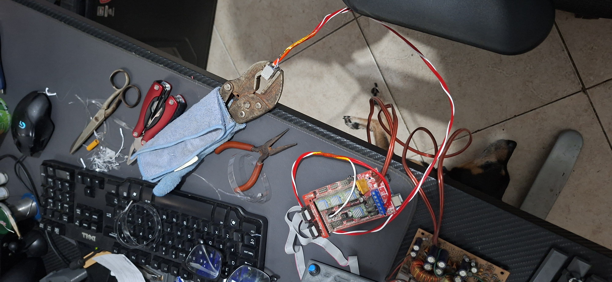
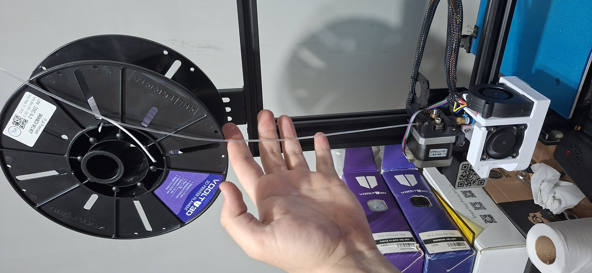
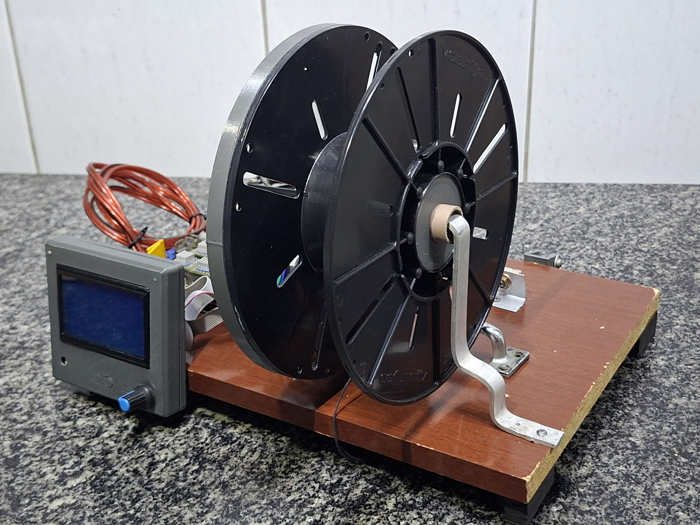
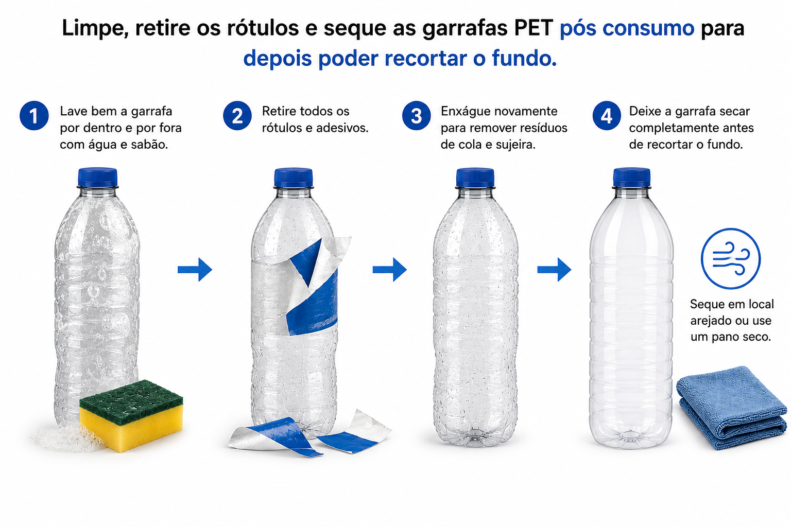
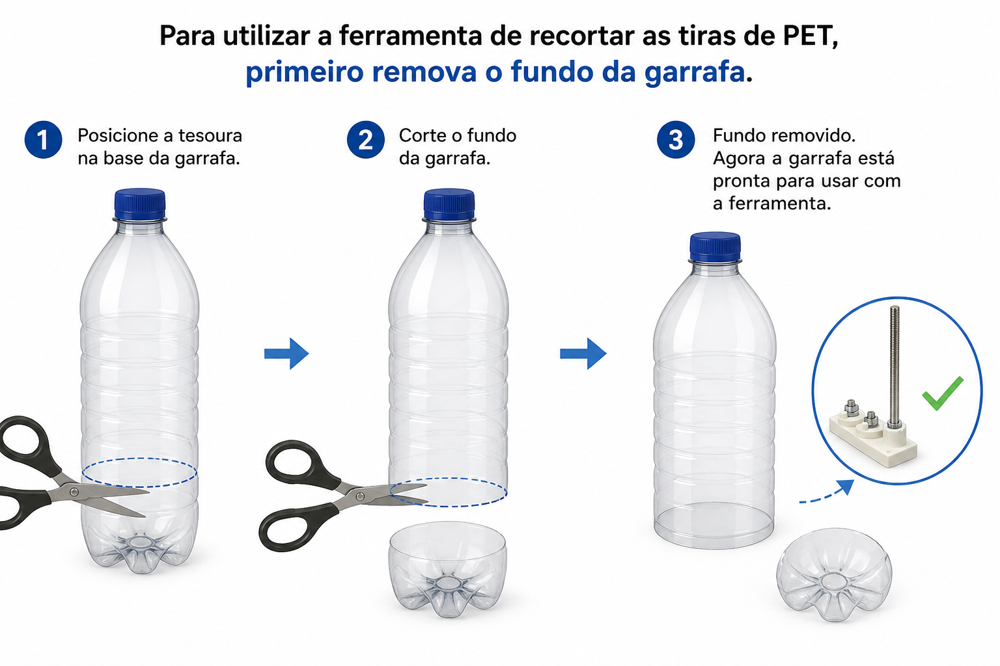
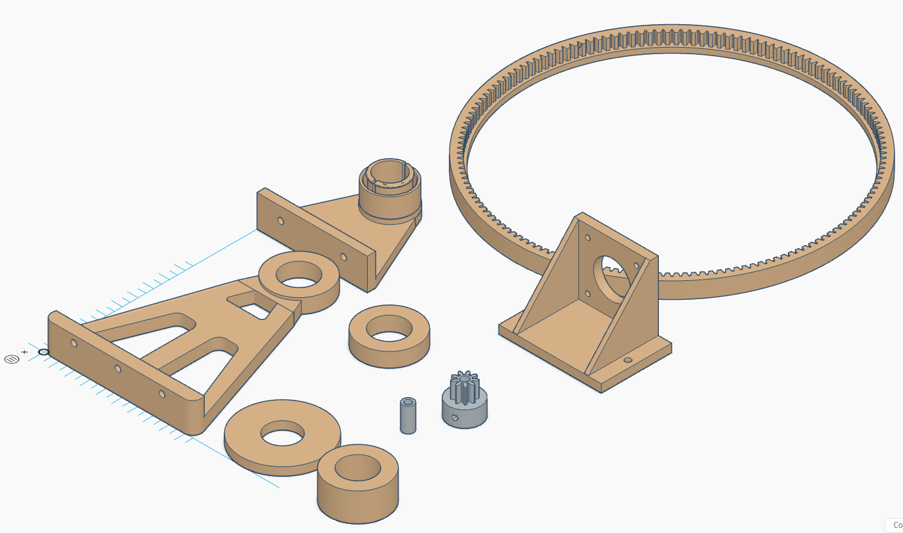
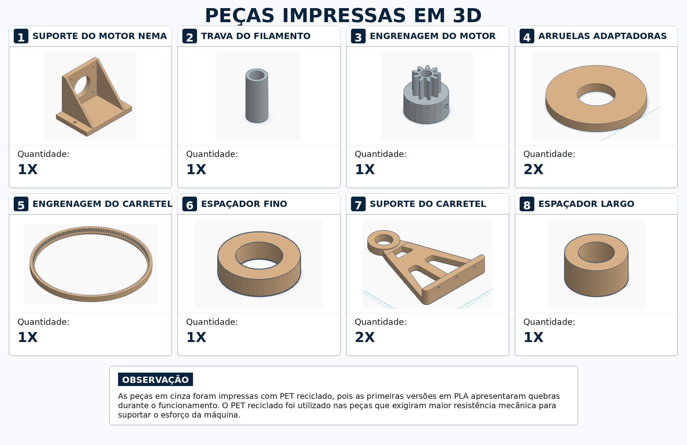
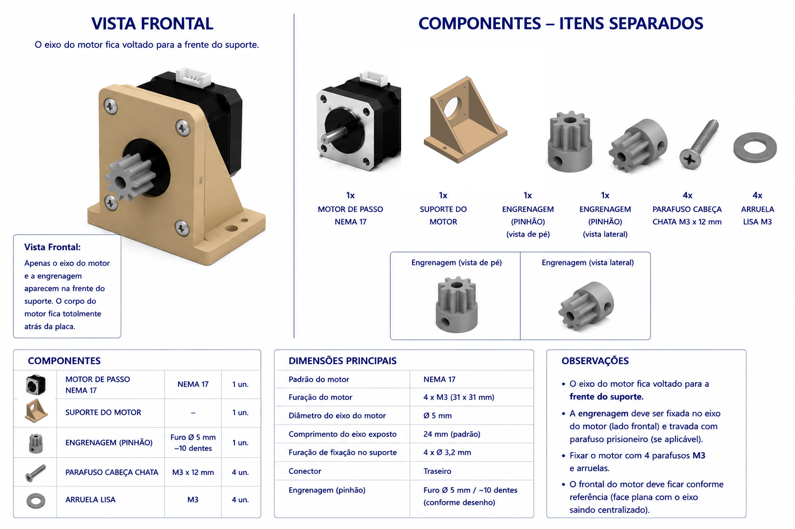
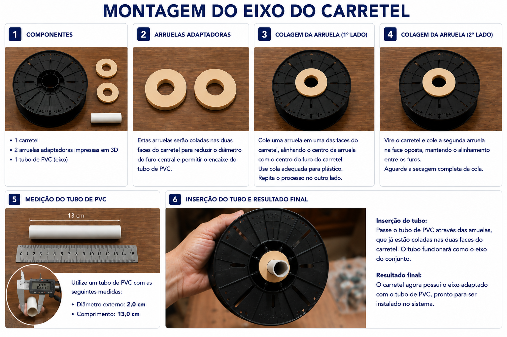
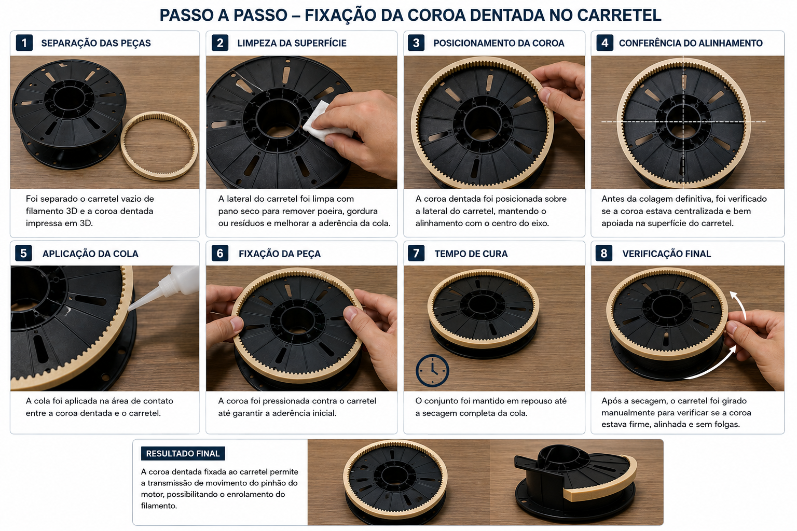

# Recicladora PET para Impressão 3D

Projeto de TCC voltado ao desenvolvimento de uma recicladora doméstica capaz de
transformar garrafas PET pós-consumo em filamento utilizável em impressoras 3D
FDM.


## Índice

- [Sobre o projeto](#sobre-o-projeto)
- [Motivação](#motivação)
- [Prova de conceito manual](#prova-de-conceito-manual)
- [Como o processo funciona](#como-o-processo-funciona)
- [Protótipos](#protótipos)
- [Vídeos do projeto](#vídeos-do-projeto)
- [Preparação do PET](#preparação-do-pet)
- [Peças impressas em 3D](#peças-impressas-em-3d)
- [Montagem dos subconjuntos](#montagem-dos-subconjuntos)
- [Extrusão e controle dimensional](#extrusão-e-controle-dimensional)
- [Primeira impressão com PET](#primeira-impressão-com-pet)
- [Controle por G-code](#controle-por-g-code)
- [Anexos e referências](#anexos-e-referências)
- [Estrutura do repositório](#estrutura-do-repositório)
- [Licença](#licença)
- [Observações técnicas](#observações-técnicas)

## Sobre o projeto

A proposta deste projeto é demonstrar, na prática, que uma garrafa PET comum pode
ser preparada, cortada em fitas, extrudada e transformada em material para
impressão 3D.

O foco não está apenas na reciclagem do plástico, mas na construção de um ciclo
completo e acessível: sair de um resíduo cotidiano e chegar a uma peça impressa
funcional. Para isso, o projeto reúne modelagem 3D, reaproveitamento de
componentes de impressora, eletrônica, controle por G-code, testes de extrusão e
ajustes de impressão.

## Motivação

Filamentos comerciais representam um custo recorrente para quem utiliza
impressão 3D. Ao mesmo tempo, garrafas PET são resíduos amplamente disponíveis e
com potencial técnico para reaproveitamento.

A recicladora foi desenvolvida para investigar uma pergunta simples:

> É possível transformar garrafas PET pós-consumo em filamento funcional para
> impressão 3D usando uma solução doméstica, de baixo custo e reproduzível?

O projeto também tem um objetivo educacional: documentar o processo de forma
clara para que outras pessoas possam entender as decisões de construção, os
testes realizados e os limites encontrados.

## Prova de conceito manual

Antes da construção dos protótipos, o primeiro teste foi feito de forma manual
para verificar se o princípio do projeto era possível.

Foi utilizado o bloco gerador de calor do hotend E3D, segurado com um alicate de
pressão, e uma placa RAMPS para controlar o aquecimento. A ideia era simples: se
a fita de PET conseguisse passar pelo bloco aquecido e sair em formato de
filamento, então faria sentido avançar para a construção de uma recicladora com
estrutura, motor, carretel e controle por G-code.



Com o primeiro trecho de filamento puxado manualmente, o material foi testado na
impressora para verificar se o sistema conseguiria aceitá-lo, tanto pelo diâmetro
quanto pela temperatura de trabalho.



A documentação desta etapa está em
[testes/00-prova-conceito-manual](testes/00-prova-conceito-manual/).

## Como o processo funciona

O processo começa com a seleção e preparação das garrafas. Depois, o PET é
cortado em fitas, aquecido no hotend, conformado em formato de filamento e
enrolado em um carretel adaptado. O material produzido é então testado em uma
impressora 3D, exigindo ajustes próprios de temperatura, fluxo e velocidade.

## Protótipos

### Protótipo 01

O primeiro protótipo validou a montagem inicial do sistema de bobinamento, a
transmissão por engrenagens e o controle eletrônico usando RAMPS 1.4 com Arduino
Mega, LCD compatível com RAMPS e fonte ATX reaproveitada de computador.



Nesta versão, o equipamento chegou a funcionar de forma estável: bastava iniciar
o G-code e aguardar o processo de extrusão/bobinamento terminar.

Mais fotos e detalhes estão em [hardware/prototipo-01](hardware/prototipo-01/).

### Protótipo 02

O segundo protótipo reorganiza a montagem em uma base maior, separando melhor as
etapas de alimentação do material, aquecimento, eletrônica de controle e
bobinamento.


Após montar o conjunto do motor e fixar o carretel nos suportes, foi feito um
teste para verificar o alinhamento e o giro do conjunto mecânico.

Com a montagem validada, o protótipo 2 passou a funcionar corretamente, sem
ajustes pendentes para a operação normal.

Mais fotos e detalhes estão em [hardware/prototipo-02](hardware/prototipo-02/).

## Vídeos do projeto

| Vídeo | Referência no projeto | YouTube |
| --- | --- | --- |
| Protótipo 01 funcionando corretamente | [Protótipo 01](hardware/prototipo-01/#video-de-funcionamento) | [Assistir](https://youtube.com/shorts/Gr8xRWNqr9U) |
| Protótipo 02 - teste do motor e carretel | [Teste de montagem](hardware/prototipo-02/#teste-de-montagem) | [Assistir](https://youtube.com/shorts/MNewDyZXh2g) |
| Protótipo 02 funcionando corretamente | [Funcionamento correto](hardware/prototipo-02/#funcionamento-correto) | [Assistir](https://www.youtube.com/watch?v=FplmZ49YgME) |
| Primeira impressão com filamento PET reciclado | [Primeiro teste de impressão](testes/03-impressao-3d/#primeiro-teste-de-impressão) | [Assistir](https://www.youtube.com/shorts/xxXg9N6lQYA) |
| Benchy com PET de garrafa colorida | [Teste com PET colorido](testes/03-impressao-3d/#teste-com-pet-colorido) | [Assistir](https://www.youtube.com/watch?v=Nncd09i17XM) |

## Preparação do PET

Antes do corte em tiras, as garrafas precisam ser limpas, secas e preparadas. A
retirada do rótulo é importante para evitar que papel, adesivo, cola ou sujeira
contaminem a fita de PET e cheguem ao hotend durante a extrusão.



Depois da limpeza, o fundo da garrafa é removido para permitir o encaixe correto
na ferramenta de corte das tiras de PET.



Para o fatiamento da garrafa em tiras, foi utilizado o projeto
[Simple PET Bottle Cutter](https://makerworld.com/pt/models/98441-simple-pet-bottle-cutter#profileId-111492),
disponivel no MakerWorld.

A documentação desta etapa está em
[testes/01-preparacao-pet](testes/01-preparacao-pet/).

## Peças impressas em 3D

As peças estruturais e mecânicas da recicladora foram modeladas no Tinkercad e
impressas em 3D. Elas incluem suporte do motor, suporte do carretel, engrenagens,
arruelas adaptadoras e espaçadores.





Algumas peças foram posteriormente impressas com PET reciclado, pois versões
iniciais em PLA apresentaram quebras durante o funcionamento. O PET reciclado foi
usado nas peças que exigiam maior resistência mecânica.

A documentação das peças está em [modelos-3d](modelos-3d/). A tabela editável
com nomes e quantidades está em
[dados/tabelas/pecas-impressas-3d.csv](dados/tabelas/pecas-impressas-3d.csv).

Os registros de aplicação do PET reciclado estão organizados em
[pecas-impressas/testes](pecas-impressas/testes/),
[pecas-impressas/funcionais](pecas-impressas/funcionais/) e
[pecas-impressas/reposicao-prototipo](pecas-impressas/reposicao-prototipo/).

## Montagem dos subconjuntos

### Motor NEMA 17

O motor NEMA 17 é fixado em um suporte impresso em 3D. A engrenagem do motor é
instalada no eixo para transmitir movimento ao sistema de bobinamento.



Detalhes da montagem estão em
[hardware/prototipo-01/montagem/motor-nema-17](hardware/prototipo-01/montagem/motor-nema-17/).

### Carretel

O carretel é reaproveitado de filamento 3D e adaptado com arruelas impressas,
tubo de PVC e uma coroa dentada impressa em 3D.





Detalhes da preparação estão em
[hardware/prototipo-01/montagem/carretel](hardware/prototipo-01/montagem/carretel/).

## Extrusão e controle dimensional

As fitas de PET são aquecidas no hotend e conduzidas até o carretel de
armazenamento. Nos testes, a temperatura de extrusão variou entre 230 °C e
240 °C, com melhor estabilidade observada em 230 °C.

Após o resfriamento, o filamento é medido com paquímetro em diferentes pontos,
tendo como referência o diâmetro nominal de 1,75 mm. Como o filamento é formado
a partir de uma fita PET dobrada e conformada pelo calor, ele pode apresentar
interior oco, ovalização e pequenas variações dimensionais.

A documentação desta etapa está em
[testes/02-extrusao](testes/02-extrusao/). A organização dos dados de medição
está em [dados/medicoes](dados/medicoes/).

## Primeira impressão com PET

Depois dos primeiros testes de geração manual do filamento, o material foi levado
para a impressora 3D. Essa etapa serviu para verificar se a impressora conseguiria
aceitar o filamento produzido, tanto pelo diâmetro quanto pela temperatura de
trabalho.

O primeiro teste de impressão também ajudou a entender quais ajustes seriam
necessários na impressora e no fatiador, como temperatura, fluxo, velocidade e
estabilidade da extrusão.

Também foram feitos testes com garrafas PET coloridas. Um dos ensaios utilizou
um barquinho Benchy para observar se o material ficaria translúcido e se a cor da
garrafa causaria alguma diferença durante a impressão.

A documentação desta etapa está em [testes/03-impressao-3d](testes/03-impressao-3d/).
Os parâmetros de fatiamento usados com PET reciclado estão em
[testes/03-impressao-3d/parametros](testes/03-impressao-3d/parametros/).

## Controle por G-code

Na versão com eletrônica reaproveitada da Ender 3 Pro, a recicladora utiliza a
placa principal e o firmware original da impressora. Não há firmware customizado
gravado na placa.

Os parâmetros necessários para a operação são definidos temporariamente no início
dos arquivos G-code. Isso inclui temperatura do hotend, extrusão relativa,
steps/mm temporário do extrusor, limite de velocidade, aceleração, jerk e
multiplicador de velocidade.

Os G-codes utilizados no projeto trabalham com três temperaturas de extrusão:

| Arquivo | Temperatura | Uso |
| --- | ---: | --- |
| `PET_230c_20m.gcode` | 230 °C | Extrusão em temperatura mais baixa. |
| `PET_235c_20m.gcode` | 235 °C | Extrusão em temperatura intermediária. |
| `PET_240c_20m.gcode` | 240 °C | Extrusão em temperatura mais alta. |

A documentação desta parte está em [codigo/gcode](codigo/gcode/) e a nota sobre
firmware original está em
[codigo/firmware-original-creality.md](codigo/firmware-original-creality.md).

## Anexos e referências

Os links auxiliares da monografia, incluindo cortador de garrafa PET, suporte
para bobinas de tiras e hotend E3D V6, estão reunidos em [anexos](anexos/).

As referências bibliográficas usadas como base teórica e técnica estão em
[docs/referencias](docs/referencias/).

## Estrutura do repositório

```text
.
├── docs/
│   ├── monografia/
│   ├── referencias/
│   └── apresentacoes/
├── hardware/
│   ├── prototipo-01/
│   └── prototipo-02/
├── modelos-3d/
│   ├── stl/
│   ├── fatiamento/
│   └── imagens/
├── codigo/
│   ├── gcode/
│   ├── scripts/
│   └── firmware-original-creality.md
├── testes/
│   ├── 00-prova-conceito-manual/
│   ├── 01-preparacao-pet/
│   ├── 02-extrusao/
│   ├── 03-impressao-3d/
│   └── 04-resistencia/
├── pecas-impressas/
├── dados/
└── anexos/
```

## Licença

Este projeto está licenciado sob a
[Creative Commons Attribution-NonCommercial-ShareAlike 4.0 International](LICENSE)
(CC BY-NC-SA 4.0).

O material pode ser acessado, copiado, compartilhado e adaptado para fins não
comerciais, desde que seja dado o devido crédito ao autor e que trabalhos
derivados sejam distribuídos sob a mesma licença ou uma licença compatível.

Uso comercial não é permitido sem autorização prévia do autor.

## Observações técnicas

- Os arquivos CAD/editáveis dos modelos 3D não são disponibilizados neste
  repositório. Para reprodução, serão fornecidos os arquivos STL.
- O código-fonte do firmware da Creality também não é disponibilizado. A placa e
  o firmware permanecem originais da Ender 3 Pro.
- As alterações de parâmetros da máquina são feitas pelos arquivos G-code, sem
  gravação permanente com `M500`.
- O projeto está em desenvolvimento e este repositório funciona como registro
  técnico, visual e experimental da construção.
