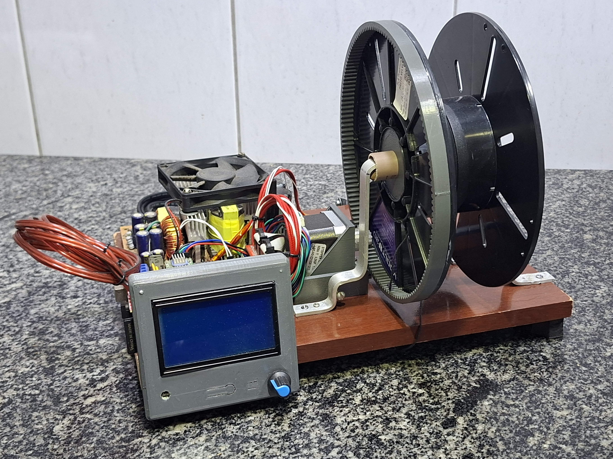
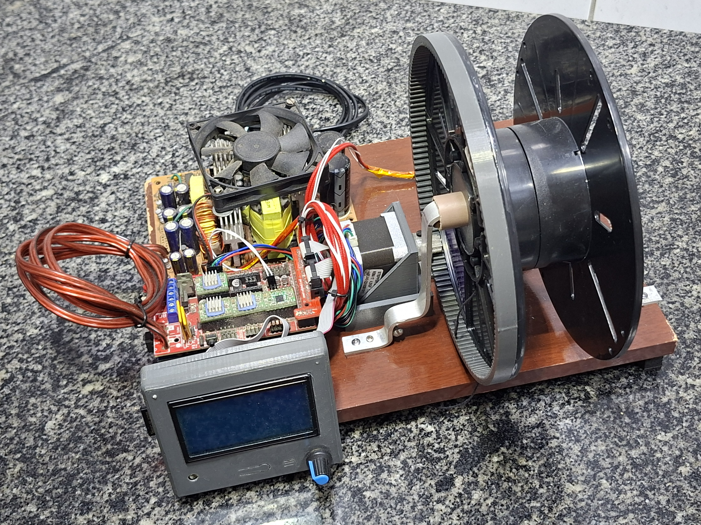
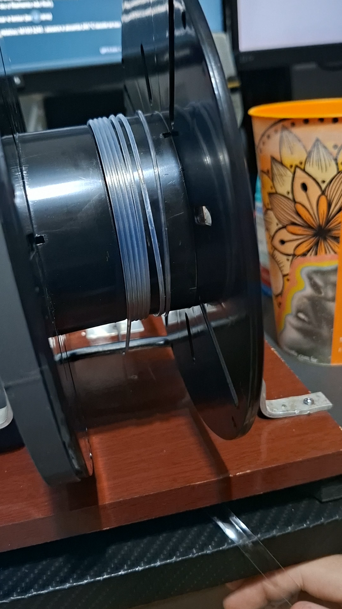

# Prototipo 01

Esta pasta documenta a primeira versao montada da recicladora de PET para
impressao 3D.

O prototipo 01 foi construido como uma versao funcional inicial, usando uma base
de madeira, componentes reaproveitados de impressora 3D, pecas impressas em 3D e
um sistema de carretel adaptado para bobinar o filamento produzido.

## Fotos gerais

## Video de funcionamento

[Assistir no YouTube](https://youtube.com/shorts/Gr8xRWNqr9U)

Neste registro, o prototipo 01 ja estava operando de forma estavel. A recicladora
conseguia executar o processo normalmente: iniciar o G-code, aguardar o aquecimento
e deixar o equipamento trabalhar ate o fim da extrusao/bobinamento.

## Componentes visiveis

- Base de madeira usada como estrutura principal.
- Carretel reaproveitado para enrolamento do filamento.
- Coroa dentada fixada ao carretel.
- Motor de passo NEMA 17.
- Engrenagem do motor para transmissao de movimento ao carretel.
- Suportes metalicos e pecas impressas em 3D para fixacao.
- Display LCD compativel com RAMPS.
- Placa controladora RAMPS 1.4 com Arduino Mega.
- Fonte ATX reaproveitada de computador para alimentacao do conjunto.

## Funcao desta versao

O objetivo do prototipo 01 foi validar a montagem fisica do sistema de
bobinamento usando eletronica baseada em RAMPS 1.4 com Arduino Mega. A partir
dessa versao, foi possivel testar o acionamento do motor, o alinhamento do
carretel, a transmissao por engrenagens e a operacao por G-code.

## Observacoes de projeto

- A eletronica desta etapa ainda usava RAMPS 1.4 com Arduino Mega e LCD
  compativel com RAMPS.
- A placa e o LCD da Creality/Ender 3 Pro ainda nao faziam parte desta versao.
- Os parametros de operacao sao ajustados temporariamente nos arquivos G-code.
- A base de madeira facilitou ajustes de posicao, fixacao e alinhamento durante
  a prototipagem.
- O carretel foi adaptado com eixo de PVC, arruelas impressas em 3D e coroa
  dentada colada na lateral.

## Subpastas

- `fotos/`: registros fotograficos do prototipo montado.
- `montagem/`: instrucoes e imagens das etapas de montagem dos subconjuntos.
