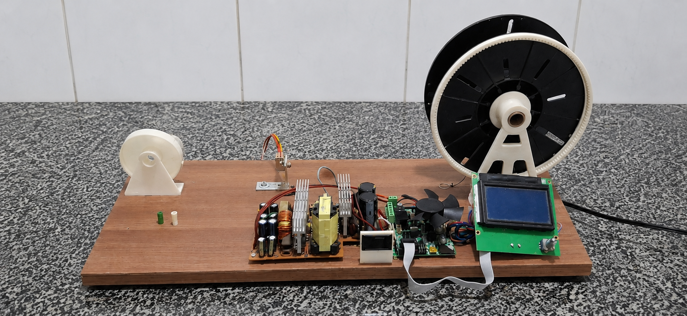
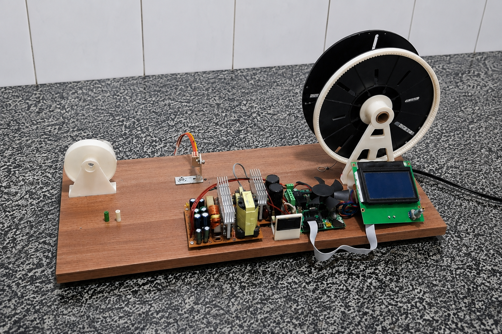
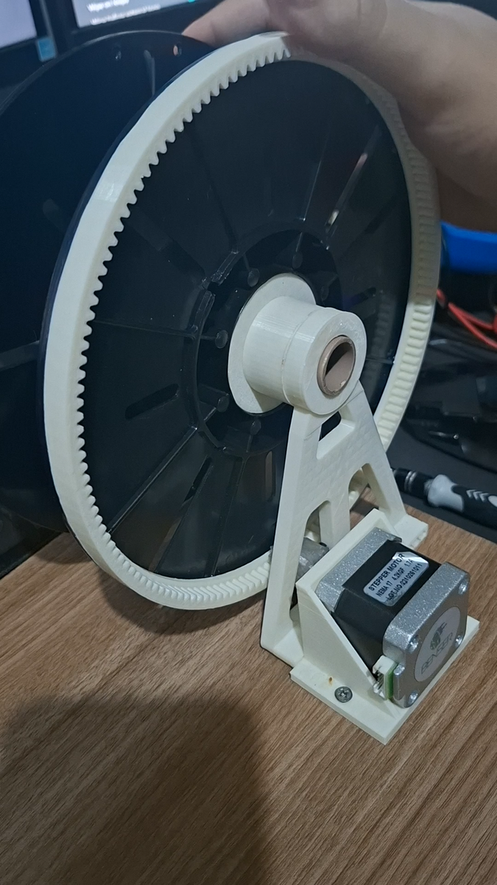
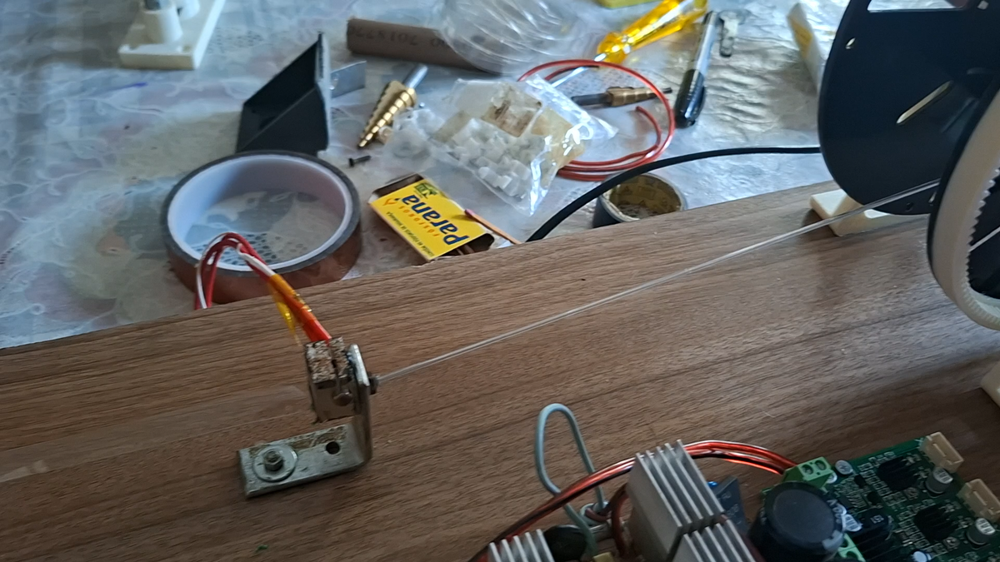

# Prototipo 02

Esta pasta documenta a segunda versao da recicladora de PET para impressao 3D.

O prototipo 02 reorganiza a montagem em uma base mais ampla, mantendo a proposta
de reaproveitamento de componentes de impressora 3D e o sistema de bobinamento
com carretel adaptado.

## Fotos gerais

## Teste de montagem

[Assistir no YouTube](https://youtube.com/shorts/MNewDyZXh2g)

Este registro mostra o teste logo apos a montagem do conjunto do motor e a
fixacao do carretel nos suportes. A etapa serviu para conferir se o conjunto
mecanico estava alinhado e se o carretel poderia girar corretamente antes da
integracao completa com o restante do equipamento.

## Funcionamento correto

[Assistir no YouTube](https://www.youtube.com/watch?v=FplmZ49YgME)

Este video registra o prototipo 02 ja funcionando corretamente, sem ajustes ou
detalhes pendentes para a operacao. Nesta fase, o equipamento conseguia executar
o processo de extrusao e bobinamento de forma estavel apos o inicio do G-code.

## Componentes visiveis

- Base de madeira maior para acomodar os subconjuntos.
- Suporte separado para o rolo/fita de PET na lateral esquerda.
- Conjunto de aquecimento/hotend posicionado antes do sistema de bobinamento.
- Fonte de alimentacao reaproveitada.
- Placa principal e eletronica reaproveitadas da Ender 3 Pro.
- Display LCD posicionado proximo ao carretel.
- Carretel adaptado com coroa dentada.
- Suporte impresso em 3D para sustentacao do carretel.

## Funcao desta versao

O objetivo do prototipo 02 e evoluir a organizacao fisica do equipamento,
separando melhor as etapas de alimentacao do material, aquecimento/extrusao,
controle eletronico e bobinamento.

Essa versao tambem ajuda a documentar a continuidade do desenvolvimento do
projeto, mostrando que a recicladora passou por iteracoes de montagem e ajuste
apos o primeiro prototipo.

## Pontos para complementar

Ainda podem ser registrados nesta pasta:

1. O que mudou em relacao ao prototipo 01.
2. Quais problemas do prototipo 01 motivaram essa nova montagem.
3. Quais pecas foram mantidas, substituidas ou reposicionadas.
4. Se houve melhoria no alinhamento, estabilidade, seguranca ou qualidade do
   filamento.
5. Quais testes foram realizados especificamente com o prototipo 02.
