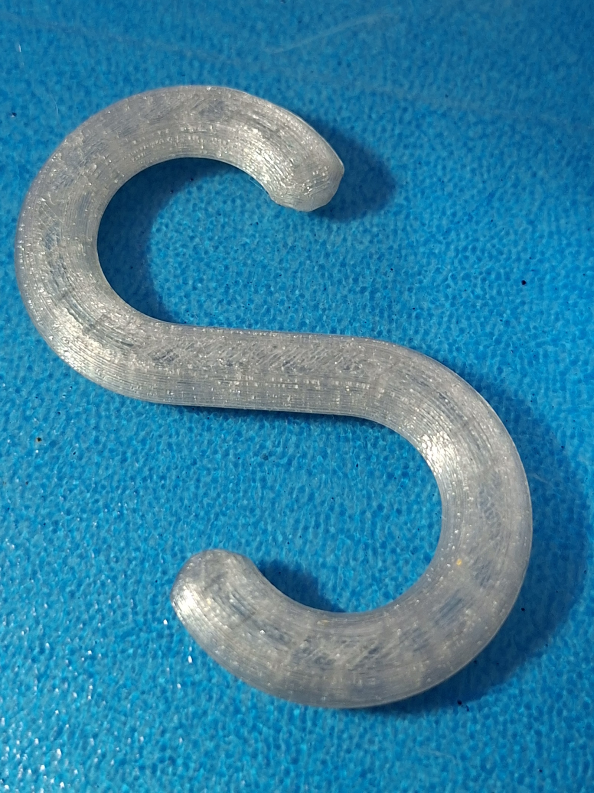
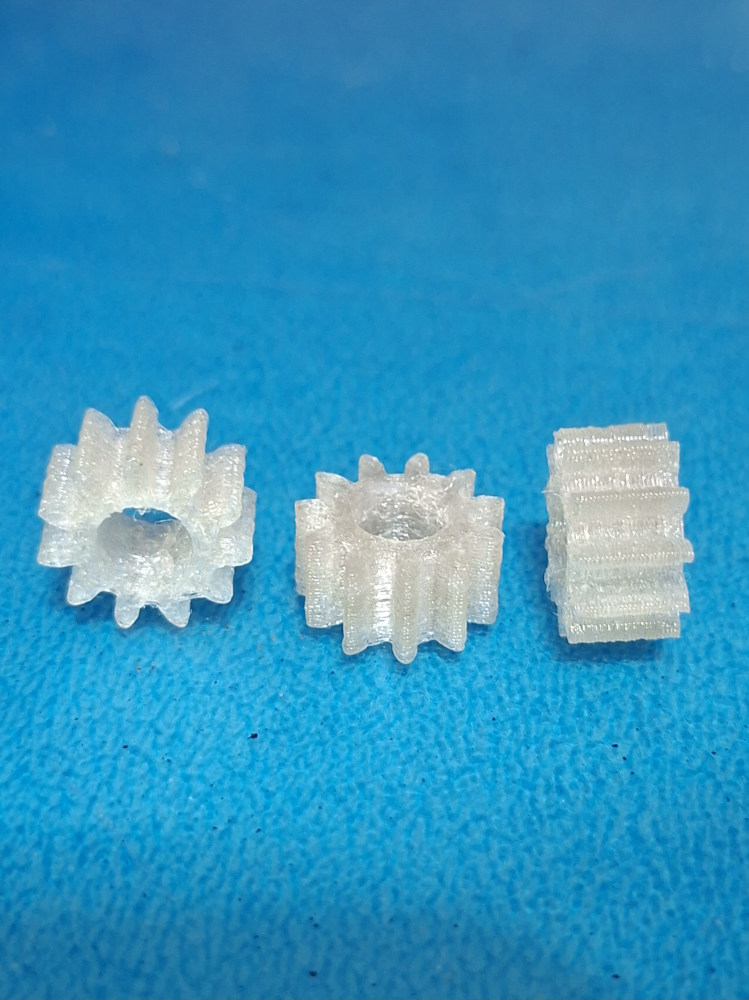
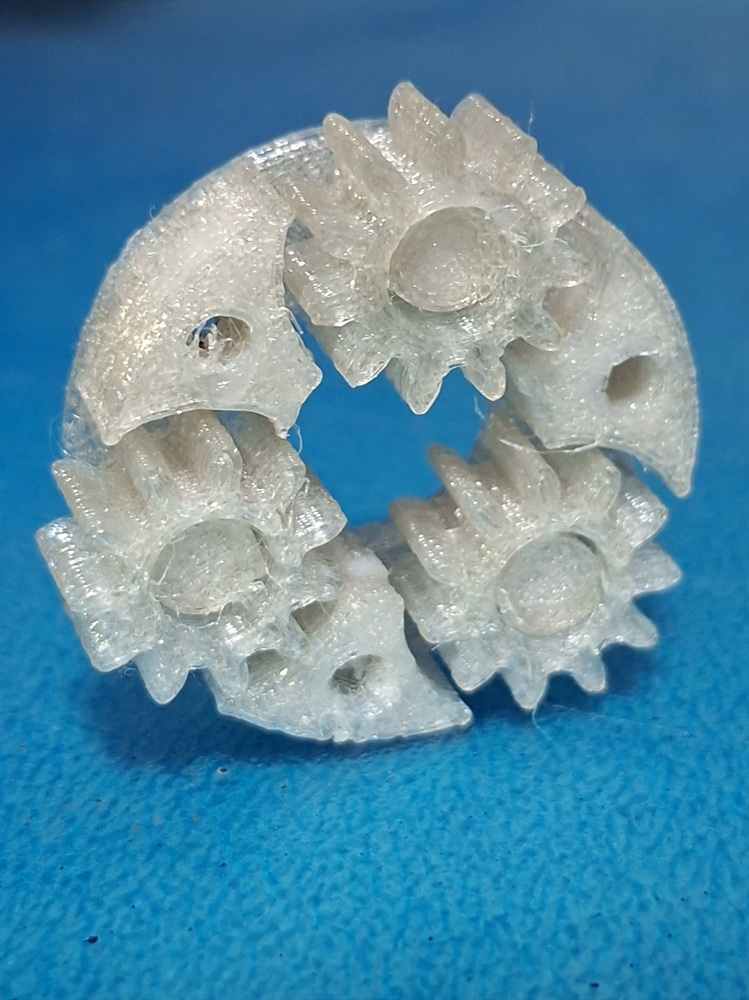
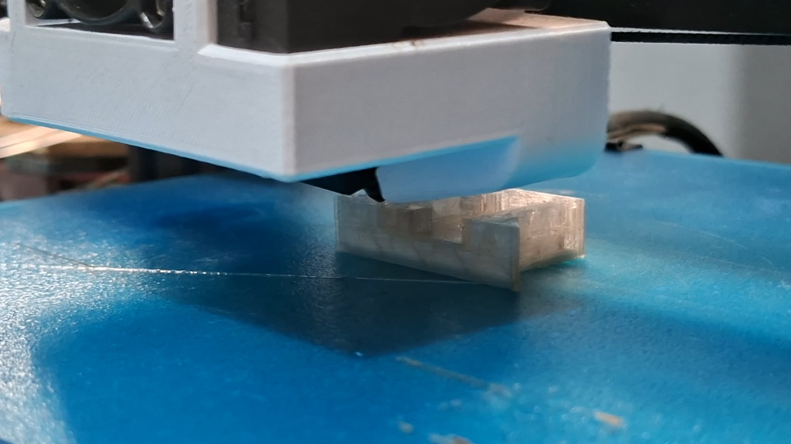
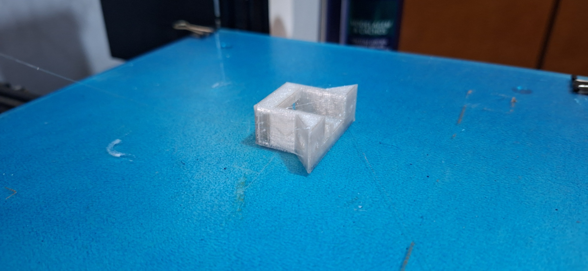
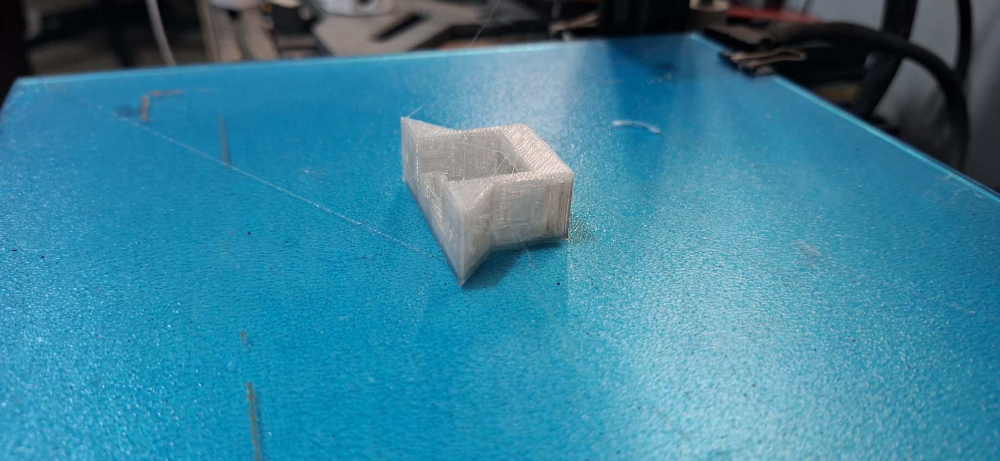
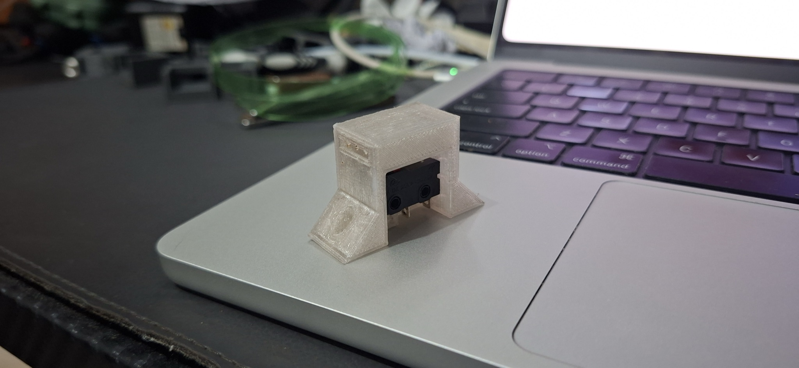
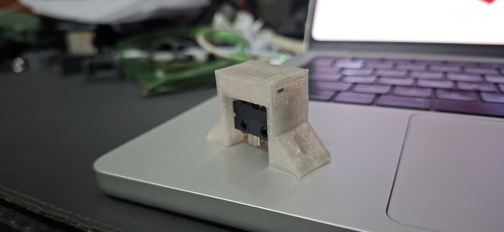
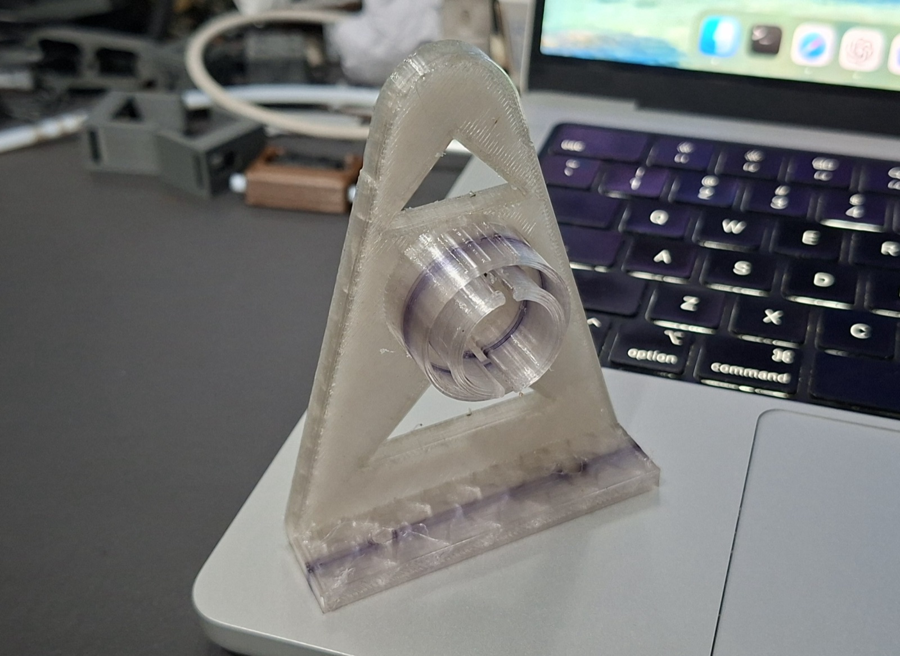
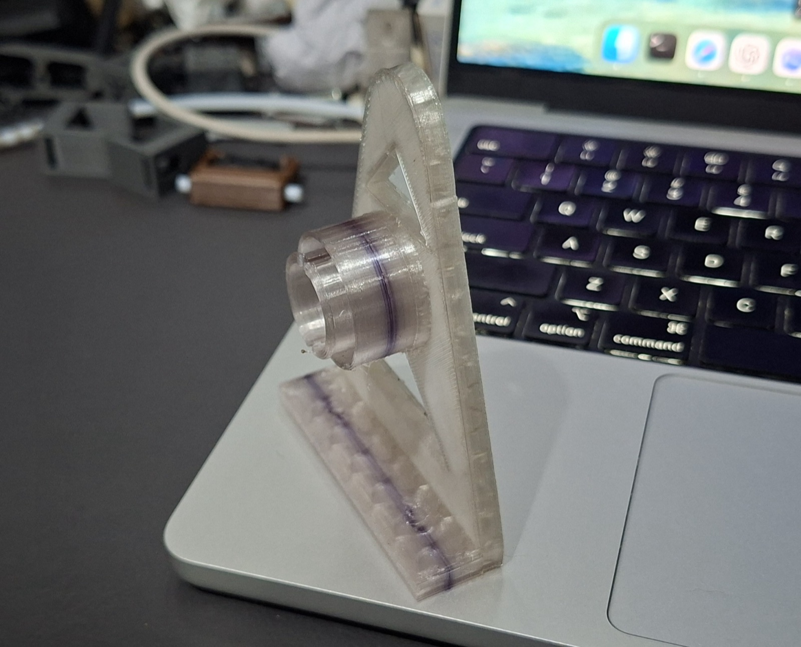

# Pecas funcionais

Esta pasta documenta pecas funcionais impressas com o filamento PET reciclado
produzido no projeto.

Depois dos primeiros testes de calibracao, o filamento foi usado em pecas com
aplicacao pratica, incluindo ganchos e componentes mecanicos de projetos
auxiliares.

## Exemplos documentados na monografia

| Peca | Foto | Finalidade |
| --- | --- | --- |
| Gancho em formato de S | [`fotos/gancho-s-pet-reciclado.jpg`](fotos/gancho-s-pet-reciclado.jpg) | Teste de aplicacao domestica para pendurar mochila, sacolas e outros itens. |
| Engrenagens para eixo planetario | [`fotos/engrenagens-pet-reciclado.jpg`](fotos/engrenagens-pet-reciclado.jpg) | Teste mecanico com geometrias funcionais. |
| Conjunto de engrenagens planetario | [`fotos/conjunto-engrenagens-planetario-pet-reciclado.jpg`](fotos/conjunto-engrenagens-planetario-pet-reciclado.jpg) | Avaliacao de montagem e funcionamento em conjunto mecanico. |
| Suporte do switch da fita PET | [`fotos/suporte-switch-fita-pet-montado-01.jpg`](fotos/suporte-switch-fita-pet-montado-01.jpg) | Suporte para montagem do switch usado no caminho da fita PET. |
| Suporte do carretel da fita PET | [`fotos/suporte-carretel-fita-pet-01.jpg`](fotos/suporte-carretel-fita-pet-01.jpg) | Suporte para o carretel que armazena e alimenta a fita PET. |

## Suporte do switch da fita PET

[Assistir no YouTube](https://youtu.be/djwcRPlRVBY)

## Suporte do carretel da fita PET

[Assistir no YouTube](https://youtu.be/MDmy_xOUEg0)

## Pontos avaliados

- resistencia percebida durante o uso;
- estabilidade dimensional;
- acabamento visual;
- fusao entre camadas;
- adequacao do material para pecas com funcao mecanica ou domestica.
