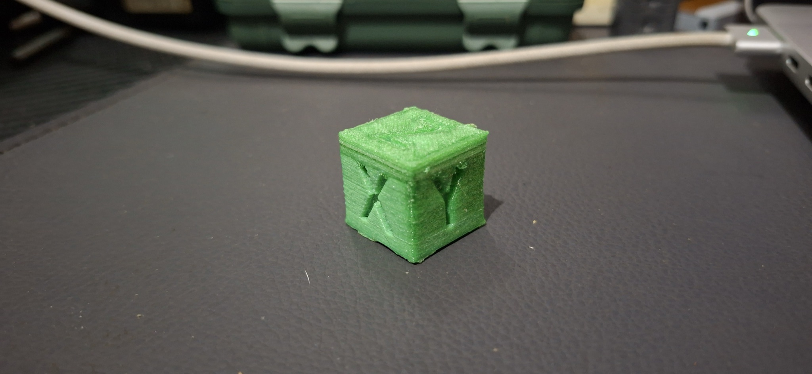
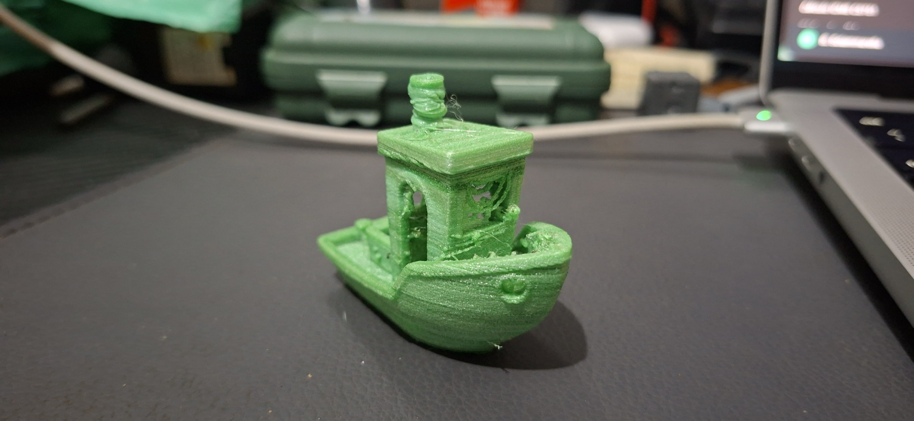

# Pecas de teste

Esta pasta documenta pecas impressas para avaliar o comportamento do filamento
PET reciclado durante a impressao 3D.

## Modelos usados

| Peca | Foto | Finalidade |
| --- | --- | --- |
| Cubo XYZ | [`fotos/cubo-xyz-pet-reciclado.jpg`](fotos/cubo-xyz-pet-reciclado.jpg) | Avaliar dimensao, estabilidade de deposicao e coerencia geometrica. |
| Benchy | [`fotos/benchy-pet-reciclado.jpg`](fotos/benchy-pet-reciclado.jpg) | Avaliar acabamento, temperatura, velocidade, fusao entre camadas e comportamento em geometrias variadas. |

## Criterios observados

- aderencia da primeira camada;
- estabilidade da extrusao;
- fusao entre camadas;
- acabamento visual;
- dimensoes finais;
- comportamento em curvas, pontes e detalhes pequenos;
- necessidade de ajustes de temperatura, fluxo e velocidade volumetrica.

Esses testes serviram para encontrar um conjunto minimo de parametros viaveis
para uso do filamento reciclado em impressora FDM.
