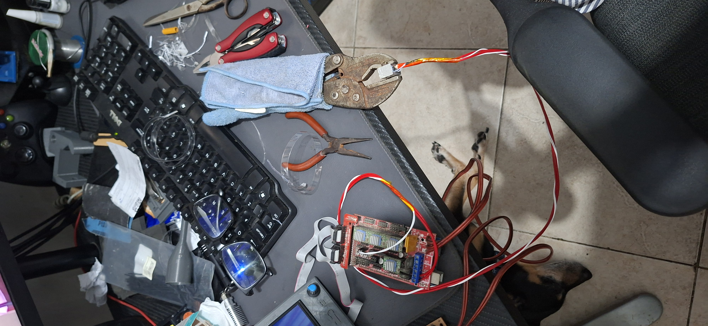

# Prova de conceito manual

Antes da construcao do equipamento, foi realizado um teste manual para verificar
se a ideia central do projeto era viavel: transformar uma fita de PET em
filamento usando aquecimento e tracao.

Neste teste inicial, foi utilizado o bloco gerador de calor do hotend E3D,
segurado com um alicate de pressao, e uma placa RAMPS para controlar o
aquecimento. A fita de PET era passada manualmente pelo bloco aquecido para
observar se o material amolecia, se fechava e se formava um filamento continuo.

Depois da formacao do primeiro trecho de filamento, o material foi levado ate a
impressora 3D para verificar se poderia ser aceito pelo sistema de alimentacao.
Esse teste avaliou dois pontos fundamentais: se o diametro estava proximo o
suficiente para passar pelo extrusor e se o material poderia trabalhar em uma
faixa de temperatura compativel com a impressora.

## Objetivo do teste

O objetivo era validar a possibilidade fisica do processo antes de investir tempo
na construcao da recicladora completa.

Se o PET conseguisse formar filamento manualmente a partir do bloco aquecido, o
projeto teria uma base tecnica para evoluir para uma versao mecanizada, com motor,
carretel, estrutura fixa e controle por G-code.

## Componentes usados

| Componente | Funcao no teste |
| --- | --- |
| Bloco aquecedor E3D | Aquecer e conformar a fita de PET. |
| Alicate de pressao | Segurar o bloco aquecido durante o teste manual. |
| Placa RAMPS | Controlar o aquecimento do conjunto. |
| Fonte de alimentacao | Alimentar a eletronica e o bloco aquecedor. |
| Fita de PET | Material testado para geracao de filamento. |

## Resultado esperado

O teste buscava confirmar que a fita de PET poderia:

- amolecer ao passar pelo bloco aquecido;
- dobrar e fechar sobre si mesma;
- sair em formato aproximado de filamento;
- manter continuidade suficiente para justificar a construcao da maquina.
- ser aceito pela impressora em relacao ao diametro e a temperatura de trabalho.

Essa etapa funcionou como ponto de partida experimental do projeto. A partir dela,
o desenvolvimento avancou para a criacao de uma estrutura propria de tracao,
bobinamento e controle.
