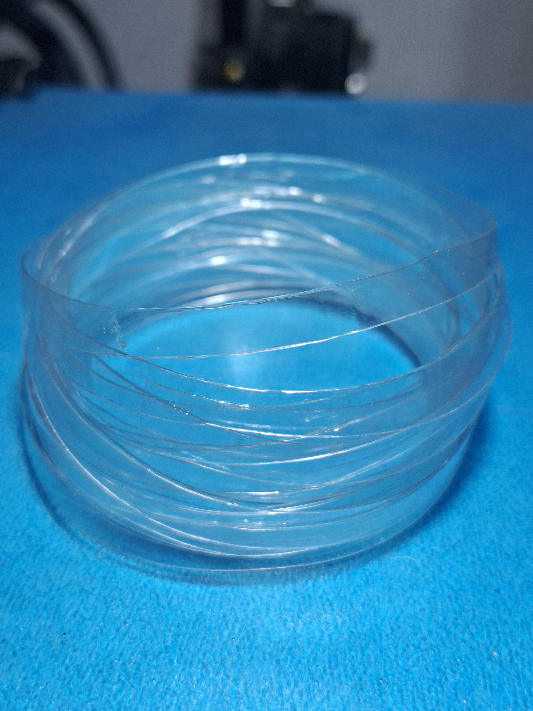
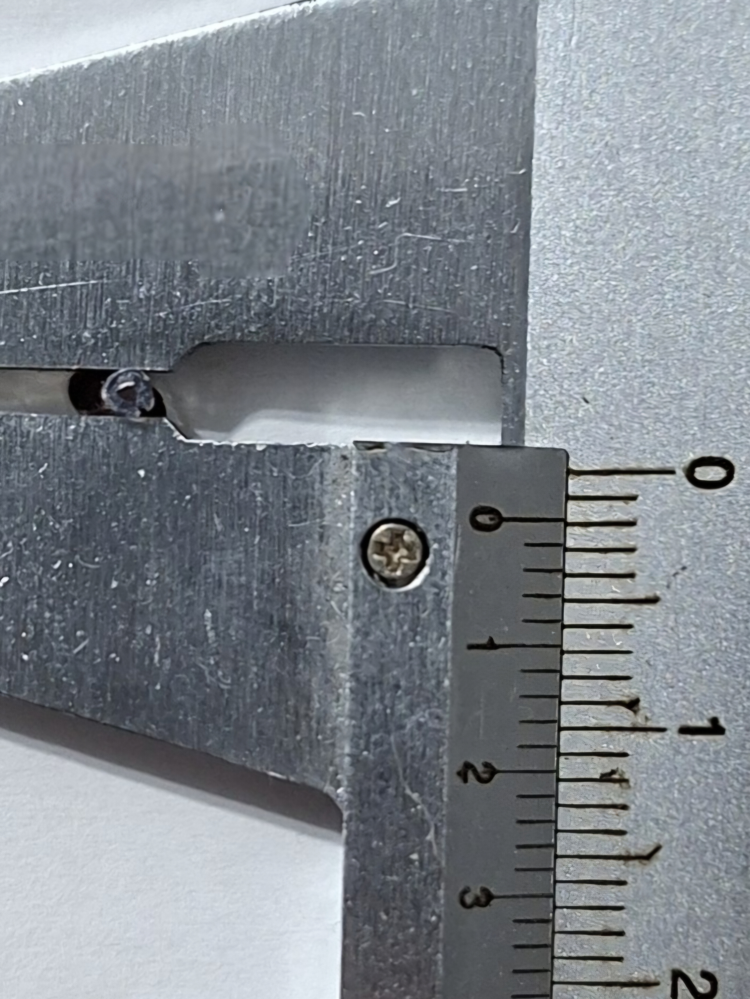
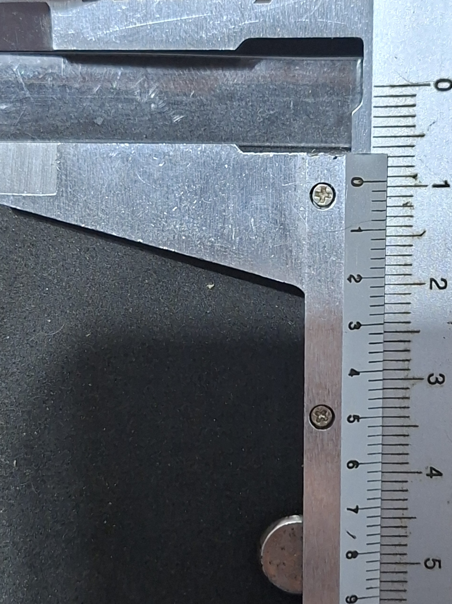
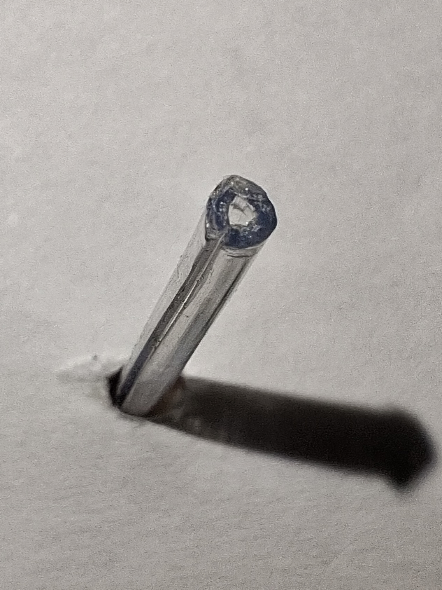
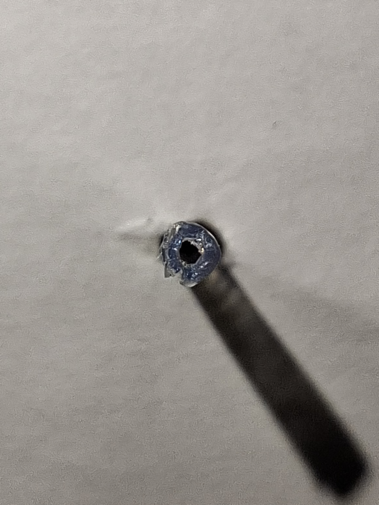

# Extrusao e controle dimensional

Esta etapa documenta os testes de extrusao das fitas de PET preparadas a partir
de garrafas pos-consumo.

O objetivo foi avaliar se a fita de PET poderia ser aquecida, conformada e
bobinada em formato aproximado de filamento para impressao 3D, tendo como alvo o
diametro nominal de 1,75 mm.

## Procedimento geral

1. Preparar as garrafas PET, removendo rotulos, cola, sujeira e umidade.
2. Cortar as garrafas em fitas longitudinais.
3. Alimentar a fita no conjunto de aquecimento da recicladora.
4. Conduzir o material extrudado ate o carretel de armazenamento.
5. Deixar o filamento estabilizar por resfriamento em temperatura ambiente.
6. Medir o diametro em diferentes pontos usando paquimetro.

## Temperatura de extrusao

Durante os testes, a temperatura do bico variou entre 230 °C e 240 °C.

A temperatura de 230 °C foi registrada como a condicao mais estavel nos testes,
pois apresentou melhor acabamento superficial, aspecto visual mais cristalino e
formato dimensional mais uniforme.

## Controle dimensional

O filamento produzido foi medido com paquimetro apos o resfriamento. A avaliacao
considerou:

- proximidade com o alvo de 1,75 mm;
- variacao dimensional ao longo do filamento;
- ovalizacao;
- irregularidades superficiais;
- estabilidade visual do material produzido.

A tolerancia usada como referencia foi de aproximadamente ±0,07 mm em torno do
diametro nominal, seguindo a faixa usualmente adotada em filamentos comerciais e
em trabalhos correlatos sobre reciclagem de PET para impressao 3D.

## Caracteristica do filamento produzido

O filamento gerado a partir da fita PET nao fica macico como um filamento
industrial. Durante a passagem pelo hotend, a fita amolece, dobra e fecha sobre
si mesma, formando uma estrutura semelhante a um tubo fino.

Essa caracteristica explica parte dos ajustes necessarios na etapa de impressao,
principalmente o aumento de fluxo e a reducao da velocidade volumetrica maxima no
fatiador.

## Limitacoes dos dados

As medicoes desta etapa possuem carater experimental e estimativo. Os valores
podem variar conforme:

- marca, cor, espessura e composicao da garrafa;
- regularidade da fita cortada;
- umidade residual;
- estabilidade da temperatura;
- velocidade de tracao;
- alinhamento do conjunto de bobinamento;
- precisao dos instrumentos utilizados.

Os dados brutos desta etapa devem ser organizados em `dados/`.
