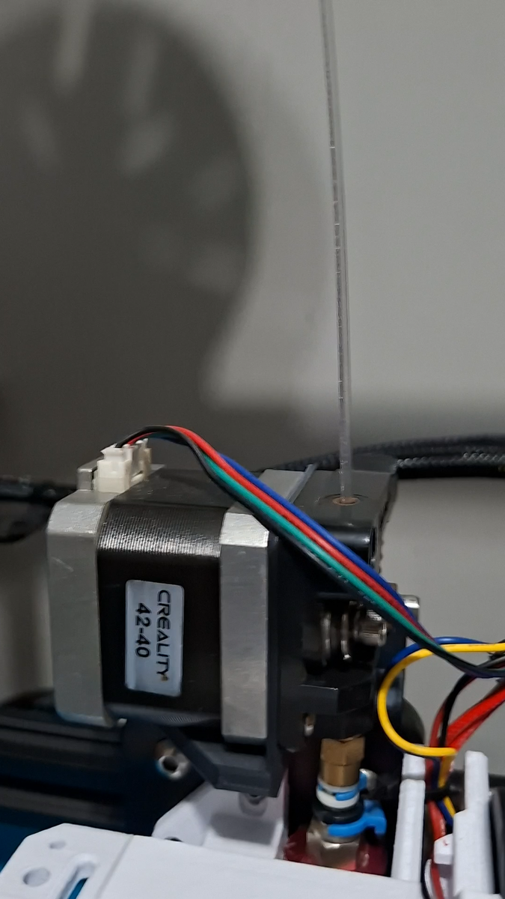
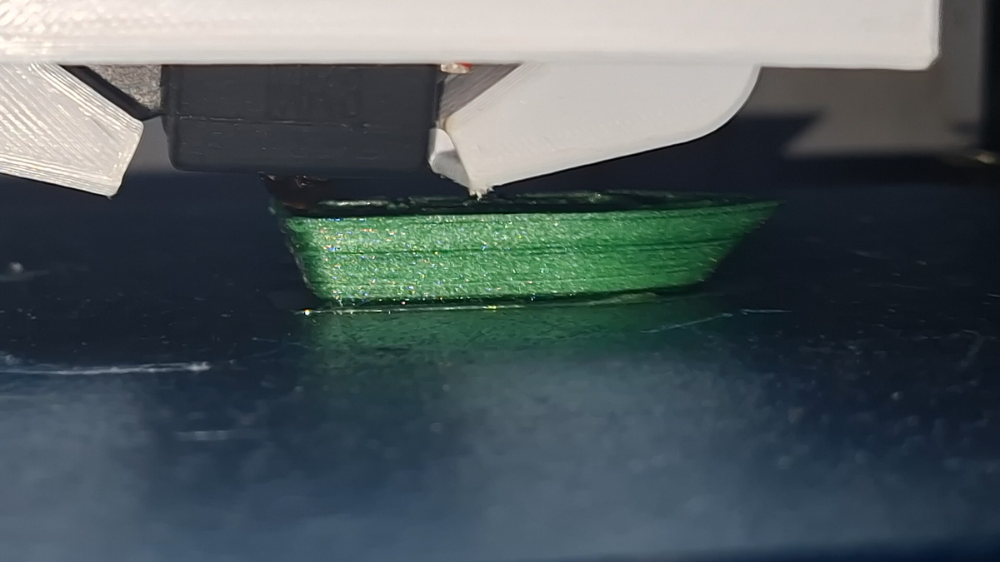

# Testes de impressão 3D com PET reciclado

Esta etapa documenta os testes realizados na impressora 3D usando o filamento de
PET produzido no projeto.

Depois da prova de conceito manual e da geração dos primeiros trechos de
filamento, o material foi testado na impressora para verificar se poderia ser
usado em uma impressão real. O objetivo inicial não era obter uma peça final
perfeita, mas entender o comportamento do material durante a alimentação,
extrusão e deposição.

## Primeiro teste de impressão



[Assistir no YouTube](https://www.youtube.com/shorts/xxXg9N6lQYA)

Este vídeo registra a primeira vez em que o filamento PET foi usado em uma
impressão 3D. O teste serviu para observar:

- se a impressora conseguiria puxar o filamento;
- se o diâmetro produzido era compatível com o caminho do extrusor;
- se a temperatura de trabalho era suficiente para fundir o PET;
- se seria necessário ajustar fluxo, velocidade ou temperatura;
- quais problemas apareceriam durante a primeira tentativa de impressão.

## Pontos avaliados

Durante os testes de impressão, os principais pontos de atenção foram:

- aderência inicial do material;
- continuidade da extrusão;
- fusão entre camadas;
- estabilidade do filamento no bico;
- necessidade de aumento do `Flow Ratio`;
- redução do `Max Volumetric Speed`;
- temperatura do hotend;
- temperatura da mesa.

## Teste com PET colorido



[Assistir no YouTube](https://www.youtube.com/watch?v=Nncd09i17XM)

Este teste utilizou a impressão de um barquinho Benchy para avaliar o
comportamento de garrafas PET coloridas. O objetivo era observar se o material
manteria translucidez após a extrusão e impressão, além de verificar se a cor da
garrafa causaria alguma diferença perceptível no comportamento do filamento.

Durante esse tipo de teste, os pontos de comparação incluem acabamento visual,
transparência/translucidez, aderência entre camadas, estabilidade da extrusão e
regularidade do material depositado.

## Relação com os parâmetros de impressão

Como o filamento produzido a partir de fita PET não é totalmente maciço, foi
necessário compensar a quantidade de material no fatiador. Nos testes do projeto,
isso levou ao aumento do fluxo e à redução da velocidade volumétrica máxima para
evitar falta ou excesso de material durante a impressão.

Os parâmetros detalhados devem ser registrados em:

```text
testes/03-impressao-3d/parametros/
```
